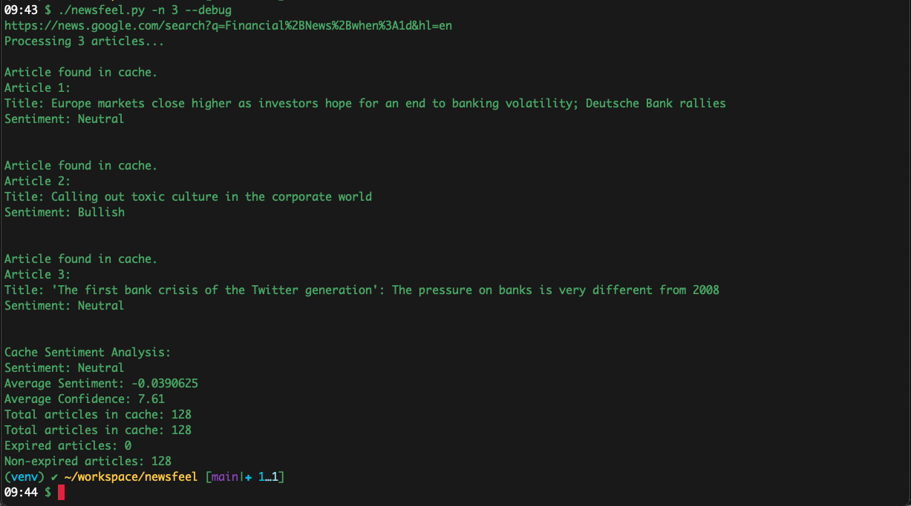

## NewsFeel

NewsFeel: A Sentiment Analysis Tool for Financial News

This repo contains a Python script for analyzing the sentiment of financial news articles. The script uses OpenAI's GPT-3 API to generate a sentiment analysis of each article, and caches the results to improve performance.

## Installation

1. Clone the repo:
```console
  git clone https://github.com/username/repo.git
```

2. Install the required packages:
```console
  pip install -r requirements.txt
```

3. Set up your OpenAI API key as an environment variable:
```console
  export OPENAI_API_KEY=your_api_key
```

## Usage
The script can be run using the following command:
```console
  python3 newsfeel.py [-h] [-n NUM_ARTICLES] [--print_cache] [--analyze_cache]
```

The optional arguments are:

- -n NUM_ARTICLES: the number of articles to process (default is 5)
- --print_cache: print all cached sentiment analysis results
- --analyze_cache: analyze sentiment analysis results in the cache and exit

When the script is run, it fetches financial news articles from Google News and processes each one using the GPT-3 API. The sentiment analysis results are printed to the console. Results are cached to improve performance, and the cache can be printed or analyzed using the optional arguments.

Note: before running the script, be sure to set up your OpenAI API key as an environment variable.




